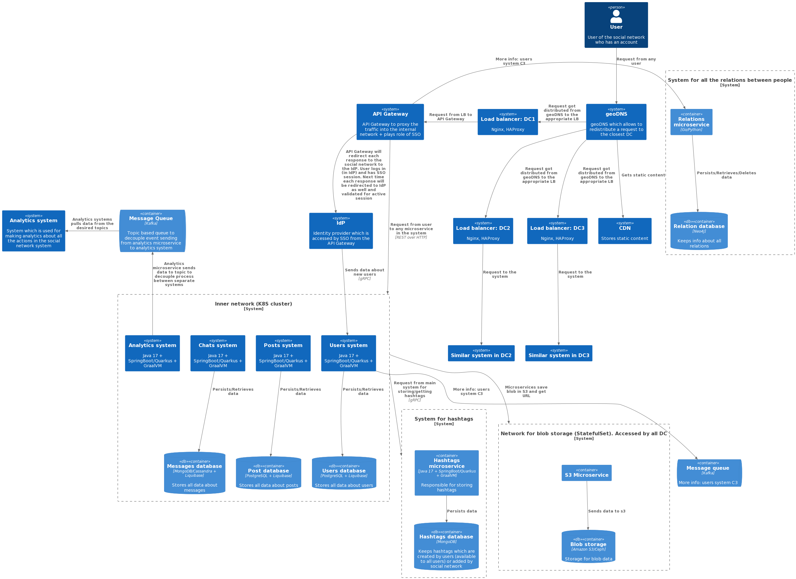

# System design for social network

* It is a repository for system design tasks of the [system design course](https://balun.courses/courses/system_design)

* **Table of contents:**
    * [Swagger file](#swagger)
    * [Database explanation](#database)
    * [Distributed storage specs](#distributed)
    * [All architecture in PNG. IMPORTANT: click on the image to open it in better quality and size](#architecture)
    * [Functional & Non-Functional requirements](#requirements)
    * [Load calculations](#load)

### API OAS3 compliant
<a id="swagger"></a>

* [API in YAML file for Swagger](api/rest_api.yml)

### Database
<a id="database"></a>

* **microservices:**
    * [dbdiagram.io file](database/microservices/social_network_db_microservices.io)
    * [png picture](database/microservices/social_network_microservices.png)
    * [sql file (just example as in the system I used not only relational databases)](database/microservices/social_network_microservices.sql)

<a id="distributed"></a>
* **distributed storage specs (partitioning/sharding/replication)**
  are [here](database/microservices/distributed_storage.md)

### Architecture
<a id="architecture"></a>

* I used C4 model for showing my design. In this very architecture I used C1, C2, C3 levels
* Explanation of this model can be found [here](https://c4model.com/)
* Repo with PlantUML extension for C4 is [here](https://github.com/plantuml-stdlib/C4-PlantUML)
  <br/><br/>
* C1 level


* C2 level (click on the image to open it in bigger size and greater quality). For more details see C3 below as it describes each system in greater detail



* C3 level
    * users: 
    * posts: 
    * chats/messages: 
    * feed: 

### Functional and Non-Functional requirements

TLDR: approximate requirements which can be altered further <br/><br/>
<a id="requirements"></a>

* **Functional**
    * _channels/chats_:
        * channels where users can read only or write/read
        * chats with another users
        * notifications from chats/channels
        * app can be on smartphone or in web
    * _messages_:
        * messages can be edited
        * messages can be a) text only b) text + images (1 or up to 5) c) audio only
        * messages have feature of "seen". If chat with user - just seen, if huge channel - x users have seen, if >
          threshold => just seen
    * _posts_:
        * users can write posts
        * posts can be edited
        * posts can have text + images (1 or up to 5)
        * posts have likes + comments
        * comments may have likes + replies
        * posts have feature **seen by** (like on LinkedIn)
        * posts must be in `order by datetime DESC`
    * _feed_:
        * feed of each user
        * feed of all users
        * feed of all groups' posts + all users' posts
    * _user_:
        * login window (happens in IdP. API Gateway helps with it)
        * home page (image, about, interests) with posts of the very user
        * settings (change password, image, about)
        * friends: add friend/delete friend <br/><br/>

* **Non-Functional**
    * DAU 40 000 000
    * MAU 38 000 000
    * 99.9% aka three nines
    * _read/write ratio_:
        * user sees a lot of posts each day (100+ posts per day)
        * user writes 1 post per day
        * user writes 40 messages per day
        * user reads 120 messages per day
        * max number of characters in the message 4 000
    * _posts and messages_:
        * posts are saved forever
        * messages have **data retention policy** of 5 years
        * max number of friends 10 000
        * max number of words in the post 5 000
    * _response time_:
        * messages: instant (<= 1 second)
        * posts: 3-5 seconds (like on LinkedIn) for the author and 10-20 seconds for another users. Don't forget sticky
          anomaly
    * _geo-distributed_: Russia (east and west), Central Asia <br/><br/>

* **Load/Storage calculations**
  <a id="load"></a>
    * 1 image (1024 X 768 pixels) is roughly 1 MB (0.75 MB exactly). Hence, overall size for pictures is 5 MB (upper
      bound):
        * https://www.pixelconverter.com/pixel-to-mb-converter/
    * for allowing all languages we will consider 3 bytes per character:
        * https://stackoverflow.com/a/14487578/16543524
    * HDD has 100/200 Mb/s throughput <br/><br/>

    * Incoming RPS for messages:
    ```
    messages per second write load: 40 000 000 * 40 / 86400 = 18 518
    messages per second read load: 40 000 000 * 120 / 86400 = 55 555
   ```
    * Incoming **traffic** for messages:
    ```
    (4000 * 3) = 12 000 bytes for each message (only text). 12 000 bytes = 0.012 MB
    0.012 + 5 (1 MB * 5) (max message size with images) = 5 MB (roughly)
    
    reading: 55 555 * 5 MB = 277 775 MB/278 GB/0.28 TB
    writing: 18 518 * 5 MB = 92590 MB/92.59 GB/0.093 TB
   ```
    * DB size for messages with **retention of 5 years**:
   ```
   0.093 Tb/s * 86 400 * 365 * 5 = 14 664 240 TB for 5 years (14 664 Pb)
   14 664 240 // 16 = 916 515 hard drives
  ```
    * Amount of **shards** for messages database:
    ```
    916 515 / 50 = 18330 shards (50 hard drives per shard)
    ```
    * Incoming RPS for posts:
    ```
    reading per second: 40 000 000 * 100 / 86 400 = 46296
    creation per second: 40 000 000 * 1 / 86 400 = 462
    ```
    * Incoming **traffic** for posts:
    ```
    (5000 * 3) = 15 000 bytes for each post max (only text). 15 000 bytes = 0.015 MB
    0.015 + 5 (1MB * 5) (max post size with images) = 5.1 MB (roughly)

    reading: 46296 * 5.1 MB = 236110 MB/237 GB/0.24 TB
    creation: 462 * 5.1 MB = 2357 MB/2.36 GB/0.002 TB
    ```
    * DB size for posts within 5 years (we have eternal retention):
    ```
    0.002 Tb/s * 86 400 * 365 * 5 = 315 360 TB for 5 years (315 Pb)
    315 360 // 16 = 19 710 hard drives
    ```
    * Amount of **shards** for messages database:
    ```
    19 700 / 50 = 394 shards (50 hard drives per shard)
    ```

**About DAU/MAU:**

https://www.indeed.com/career-advice/career-development/what-is-dau-mau-ratio

1. Average DAU = Sum of each day's unique users / Number of days in the month.
2. Average MAU = Sum of each month's unique users / 12.
3. DAU/MAU ratio = (Daily active users / Monthly active users) x 100.
